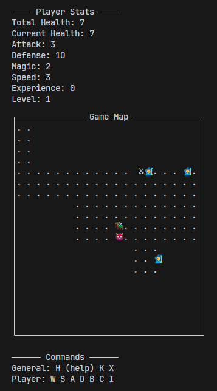
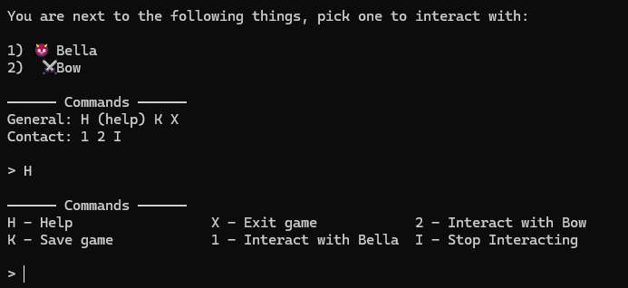
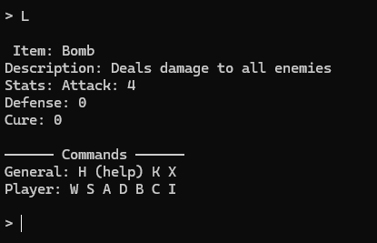
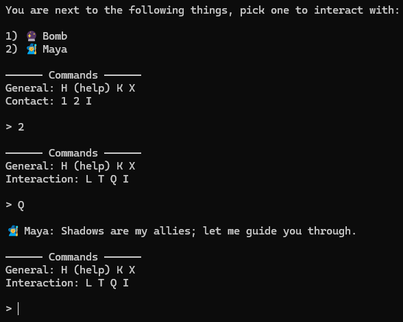
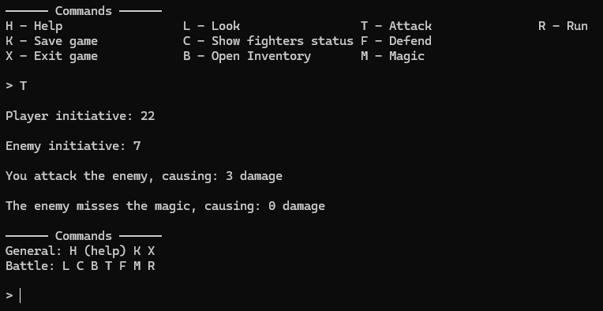

# RPG-Game

## Scope

### **Business Domain**

This project was born from the idea of creating an RPG game set in an open world, featuring inventory management, battles, NPCs, and a limitless number of procedurally generated, level-balanced maps and enemies, with a progress saving system. And also to practice Java and Object-Oriented Programming (OOP) principles.

1. **Exploring the Environment**  
   Navigate a randomly generated map with items and NPCs whose attributes scale based on the player's level.

   

2. **Interacting**  
   Players can interact with both NPCs (characters) and items in the environment.

   

3. **Managing Items**  
   Manage your inventory and interact with items during battles or map exploration.

   

4. **Talking and Observing**  
   View an NPC’s attributes, read their descriptions, and receive randomly generated dialogues when interacting.

   

5. **Battling**  
   Challenge NPCs—including peaceful characters and monsters—and loot their items after victory.

   

### **Technical Domain (Solution)**

The game is developed as a **Command Line Interface (CLI)** to ensure an intuitive and straightforward user experience.

### **Architecture Overview**


This diagram illustrates the system's structure, showing class responsibilities and how components interact to support the game’s mechanics.

---

## Learnings

- Designing gameplay mechanics in code  
- Applying object-oriented principles to real-world systems  
- Structuring classes by responsibility  

---

## Project Setup Instructions

### Prerequisites

- [Git](https://git-scm.com/)
- [Java (JDK 17+)](https://adoptium.net/)
- [Apache Maven 3.9.9](https://maven.apache.org/) (or compatible)
- [Visual Studio Code](https://code.visualstudio.com/) (recommended)

---

### Option 1: Running in VS Code

```bash
git clone https://github.com/sergiofpaim/RPG-Game.git
cd RPG-Game
code .
```

Install **recommended extensions** when prompted:
   - Java Extension Pack
   - Maven for Java

Then run the following in the terminal:

```bash
mvn clean install
mvn compile
mvn exec:java
```

---

### Option 2: Running Manually via Command Line

Make sure `java` and `mvn` are accessible from the terminal:

```bash
java -version
mvn -version
```

Then:

```bash
git clone https://github.com/sergiofpaim/RPG-Game.git
cd RPG-Game
mvn clean install
mvn compile
mvn exec:java
```

---

## Notes

- Java version used: **17.0.13**
- Maven version used: **3.9.9**
